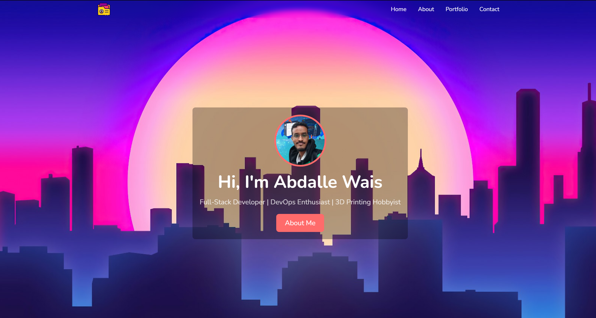
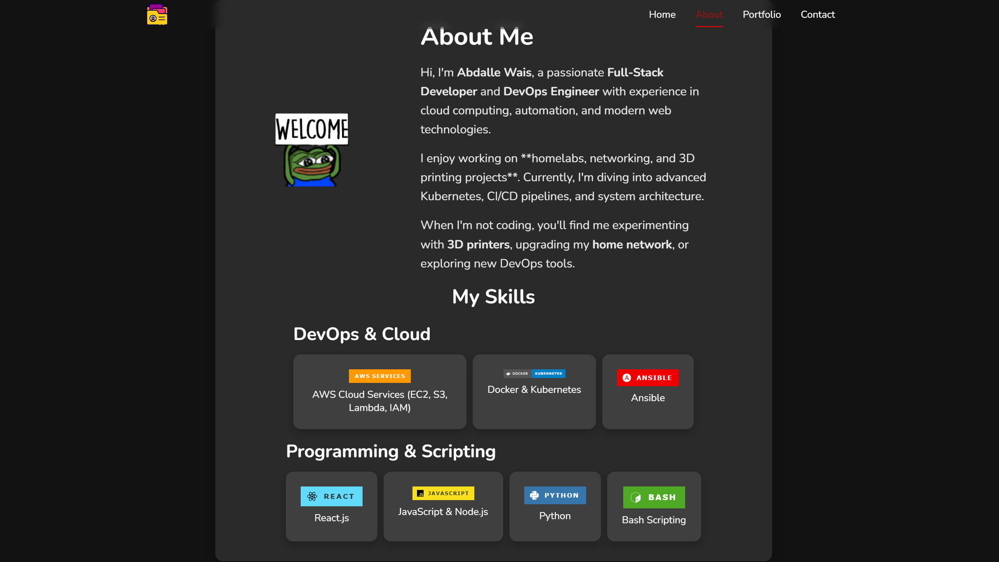
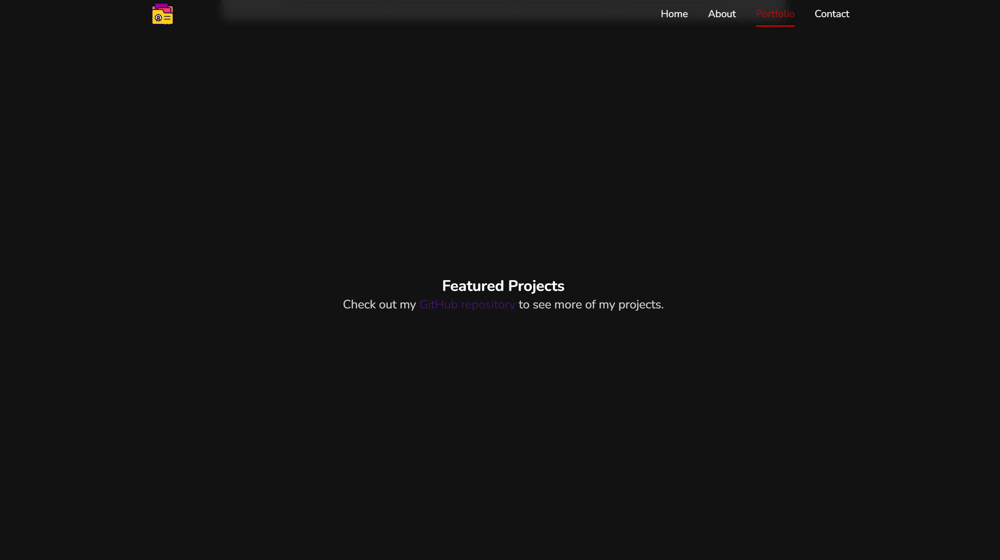

# 🚀 Personal Portfolio Website

This is my **Personal Portfolio Website**, built with **React.js**, featuring a clean and modern UI with smooth animations. It includes sections such as **About Me, Skills, Projects, and Contact**, along with a **responsive navigation menu and an animated background slideshow**.

---

## 🌟 Features

✅ **Responsive Design** - Fully optimized for mobile, tablet, and desktop  
✅ **Smooth Animations** - Powered by **Framer Motion**  
✅ **Navigation Menu** - With a **hamburger menu** for mobile  
✅ **Dark Mode Theme** - Ensures readability on all screens  
✅ **Skills Section** - Showcases my **DevOps & Full-Stack Development skills**  

---

## 🛠️ Tech Stack

- **Frontend:** React.js, CSS  
- **Animations:** Framer Motion  
- **Routing & Scrolling:** React Scroll  
- **Icons & Badges:** Shields.io  

---

## 🚀 Live Demo

[🔗 Click Here to View Portfolio](https://abeddx.github.io/portfolio/)

---

